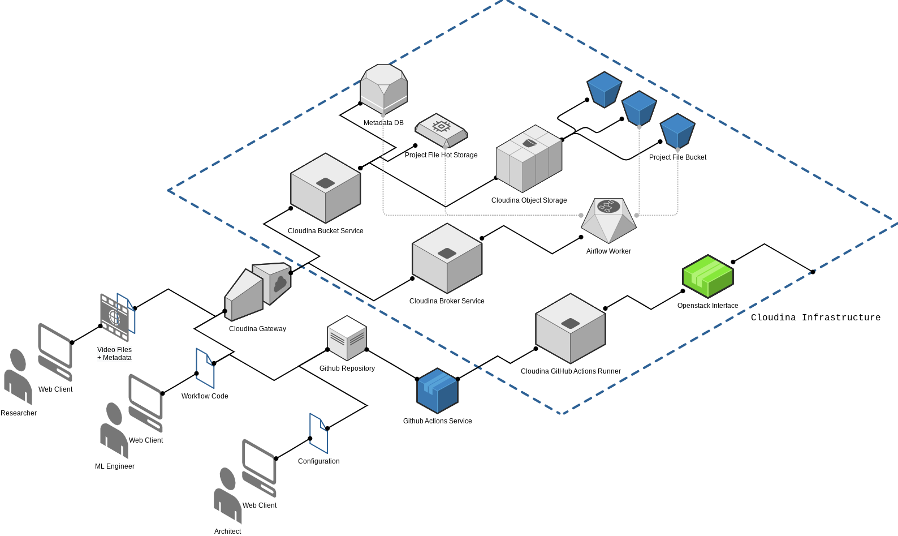

[](https://ocean-data-factory-sweden.github.io/cloudina-static/)

# Cloudina Infrastructure Repository

This repository is meant to host the configuration files needed for an
Infrastructure-as-Code deployment to a cloud provider using
[terraform](https://www.terraform.io/intro).
The cloud currently targeted is the SNIC Science Cloud (SSC), using the
[OpenStack Terraform
provider](https://registry.terraform.io/providers/terraform-provider-openstack/openstack/latest).


# First Steps

The repository uses [Github Actions](https://docs.github.com/en/actions) for
DevOps, powered by a single self-hosted runner. For bootstrapping, the runner
is deployed on the same SSC infrastructure from a local machine. Care should be
taken when handling the resulting [Terraform state
file](https://www.terraform.io/language/state) then, but since the process is
ideally only performed once, that additional effort should be minimal. The
necessary steps, using a [Variable Definitions
File](https://www.terraform.io/language/values/variables#variable-definitions-tfvars-files)
(called `snic.tfvars` in the example) for sensitive data such as login
information and the Github PAT, is

```bash
terraform -chdir=infra-runner init -input=false
terraform -chdir=infra-runner validate
terraform -chdir=infra-runner plan \
    -input=false \
    -out infra-runner.tfplan \
    -var-file="snic.tfvars"
terraform -chdir=infra-runner apply \
    -input=false \
    -var-file="snic.tfvars" \
    infra-runner.tfplan
```

# High-level overview




# OpenStack Examples

A few helpful code snippets when dealing with the SNIC/NAISS OpenStack infrastructure.

## Simple CLI Interaction

In the main OpenStack console (e.g. in the [QA environment](https://east-1.cloud.snic.se))

1. Click on "API Access"
1. Click on "Download OpenStack RC File"
1. Select "OpenStack clouds.yaml File"
1. Place the downloaded `clouds.yaml` file into the `~/.config/openstack/` folder

In a suitable Python environment, the official `python_openstackclient`
provides the CLI interface through the `openstack` tool. Provided the
`clouds.yaml` file was correctly placed as above, the tool can then be used

```bash
openstack --os-cloud=openstack --os-password ${OS_PASSWORD} network list
```
